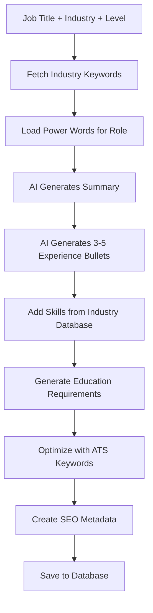

# Resume Library Strategy: How to Create 2000+ Resume Examples Like TealHQ

## Executive Summary

TealHQ has created [2,000+ resume examples](https://www.tealhq.com/resume-examples) and [100+ templates](https://www.tealhq.com/resume-templates) through a systematic, programmatic approach combining:
1. **Taxonomic Classification** - Job titles × Industries × Experience levels
2. **Template Variations** - Design variations for each category
3. **AI-Powered Content Generation** - Automated, ATS-optimized content
4. **[Power Words & Synonyms](https://www.tealhq.com/resume-synonyms)** - [900+ resume synonyms](https://www.tealhq.com/resume-synonyms) for optimization
5. **SEO Strategy** - Targeted landing pages for each resume type

---

## 1. How TealHQ Creates 2000+ Resumes at Scale

### The Mathematics of Scale

```
Resume Examples = Job Titles × Industries × Experience Levels × Template Variations

Example calculation:
- 200 job titles (Software Engineer, Product Manager, etc.)
- 20 industries (Tech, Healthcare, Finance, etc.)
- 3 experience levels (Entry, Mid, Senior)
- 2 template styles (Classic, Modern)
= 200 × 20 × 3 × 2 = 24,000 potential combinations

TealHQ focuses on the top 2000 most popular combinations
```

### Programmatic Generation Strategy

#### A. Database-Driven Content System
```typescript
// Schema for programmatic resume generation
interface ResumeExampleTemplate {
  id: string
  slug: string // SEO-friendly URL: "software-engineer-tech-senior"

  // Classification
  jobTitle: string // "Software Engineer"
  industry: string // "Technology"
  experienceLevel: 'entry' | 'mid' | 'senior' | 'executive'

  // Content Components (AI-generated or template-based)
  summary: string
  experience: ExperienceEntry[]
  skills: {
    technical: string[]
    soft: string[]
    tools: string[]
  }
  education: EducationEntry[]

  // ATS Optimization
  keywords: string[] // Industry-specific keywords
  powerWords: string[] // Action verbs from power words database

  // SEO
  metaTitle: string
  metaDescription: string
  h1: string
  targetKeywords: string[]
}
```

#### B. Content Generation Workflow



---

## 2. Classification Taxonomy System

### Primary Classification Dimensions

#### A. Job Titles (200+ categories)
```typescript
export const JOB_TITLE_CATEGORIES = {
  // Technology (40+ titles)
  technology: [
    'Software Engineer',
    'Senior Software Engineer',
    'Frontend Developer',
    'Backend Developer',
    'Full Stack Developer',
    'DevOps Engineer',
    'Data Scientist',
    'Machine Learning Engineer',
    'Product Manager',
    'Technical Product Manager',
    'UI/UX Designer',
    'Engineering Manager',
    // ... 30+ more
  ],

  // Business & Management (30+ titles)
  business: [
    'Project Manager',
    'Business Analyst',
    'Management Consultant',
    'Operations Manager',
    'Strategy Consultant',
    // ... 25+ more
  ],

  // Marketing & Sales (25+ titles)
  marketing: [
    'Marketing Manager',
    'Digital Marketing Manager',
    'Content Marketing Manager',
    'SEO Specialist',
    'Social Media Manager',
    'Sales Manager',
    'Account Executive',
    // ... 18+ more
  ],

  // Finance (20+ titles)
  finance: [
    'Financial Analyst',
    'Investment Banker',
    'Accountant',
    'Controller',
    'CFO',
    // ... 15+ more
  ],

  // Healthcare (25+ titles)
  healthcare: [
    'Registered Nurse',
    'Physician',
    'Medical Assistant',
    'Healthcare Administrator',
    // ... 21+ more
  ],

  // Creative (20+ titles)
  creative: [
    'Graphic Designer',
    'Art Director',
    'Copywriter',
    'Video Editor',
    // ... 16+ more
  ],

  // Additional categories...
}
```

#### B. Industries (20+ categories)
```typescript
export const INDUSTRIES = [
  'Technology',
  'Healthcare',
  'Finance',
  'Retail',
  'Education',
  'Manufacturing',
  'Consulting',
  'Non-Profit',
  'Government',
  'Real Estate',
  'Hospitality',
  'Media & Entertainment',
  'Telecommunications',
  'Energy',
  'Construction',
  'Transportation',
  'E-commerce',
  'SaaS',
  'Biotech',
  'Legal',
]
```

#### C. Experience Levels (4 tiers)
```typescript
export const EXPERIENCE_LEVELS = {
  entry: {
    label: 'Entry Level',
    yearsOfExperience: '0-2 years',
    targetTitles: ['Junior', 'Associate', 'Entry-Level'],
    educationFocus: true,
    internshipsFocus: true,
  },
  mid: {
    label: 'Mid-Level',
    yearsOfExperience: '3-7 years',
    targetTitles: ['Mid-Level', 'Senior Associate'],
    achievementsFocus: true,
    leadershipExperience: 'team member',
  },
  senior: {
    label: 'Senior Level',
    yearsOfExperience: '8-12 years',
    targetTitles: ['Senior', 'Lead', 'Principal'],
    leadershipFocus: true,
    strategicImpact: true,
  },
  executive: {
    label: 'Executive',
    yearsOfExperience: '13+ years',
    targetTitles: ['Director', 'VP', 'C-Suite'],
    boardExperience: true,
    p&lResponsibility: true,
  },
}
```

---

## 3. Power Words & ATS Optimization

### Power Words Database (Based on [TealHQ's 900+ synonyms](https://www.tealhq.com/resume-synonyms))

#### A. Action Verbs by Category

```typescript
export const POWER_WORDS_DATABASE = {
  // Achievement & Results ([195+ power words](https://www.tealhq.com/post/resume-power-words))
  achievement: {
    // High-impact alternatives for common words
    'improved': ['Enhanced', 'Optimized', 'Augmented', 'Elevated', 'Strengthened'],
    'increased': ['Amplified', 'Expanded', 'Boosted', 'Accelerated', 'Magnified'],
    'decreased': ['Reduced', 'Minimized', 'Streamlined', 'Curtailed', 'Condensed'],
    'managed': ['Orchestrated', 'Directed', 'Spearheaded', 'Supervised', 'Coordinated'],
    'created': ['Pioneered', 'Established', 'Launched', 'Instituted', 'Originated'],
    'optimized': ['Elevated', 'Advanced', 'Upgraded', 'Refined', 'Perfected'],
    'maximized': ['Optimized', 'Streamlined', 'Capitalized', 'Leveraged'],
  },

  // Leadership & Management
  leadership: [
    'Spearheaded', 'Championed', 'Led', 'Directed', 'Orchestrated',
    'Mentored', 'Coached', 'Cultivated', 'Empowered', 'Delegated',
    'Mobilized', 'Galvanized', 'Rallied', 'Unified', 'Aligned',
  ],

  // Technical & Innovation
  technical: [
    'Engineered', 'Architected', 'Developed', 'Programmed', 'Automated',
    'Integrated', 'Deployed', 'Configured', 'Debugged', 'Troubleshot',
    'Migrated', 'Refactored', 'Containerized', 'Orchestrated',
  ],

  // Analysis & Strategy
  analytical: [
    'Analyzed', 'Evaluated', 'Assessed', 'Diagnosed', 'Investigated',
    'Forecasted', 'Projected', 'Modeled', 'Predicted', 'Quantified',
    'Synthesized', 'Strategized', 'Conceptualized', 'Formulated',
  ],

  // Communication & Collaboration
  communication: [
    'Presented', 'Communicated', 'Negotiated', 'Facilitated', 'Advocated',
    'Collaborated', 'Partnered', 'Liaised', 'Consulted', 'Advised',
    'Articulated', 'Conveyed', 'Persuaded', 'Influenced',
  ],

  // Financial & Business
  financial: [
    'Generated', 'Revenue', 'Profit', 'ROI', 'Budget',
    'Forecasted', 'Allocated', 'Invested', 'Monetized', 'Capitalized',
    'Scaled', 'Grew', 'Expanded', 'Diversified',
  ],
}
```

#### B. ATS Keyword Optimization

```typescript
export const ATS_KEYWORDS_BY_INDUSTRY = {
  technology: {
    mustHave: [
      'Agile', 'Scrum', 'CI/CD', 'Cloud', 'AWS', 'Azure', 'Docker',
      'Kubernetes', 'Microservices', 'RESTful APIs', 'SQL', 'NoSQL',
    ],
    technical: [
      'JavaScript', 'Python', 'Java', 'React', 'Node.js', 'TypeScript',
      'Machine Learning', 'AI', 'Data Science', 'DevOps', 'Git',
    ],
    soft: [
      'Problem-solving', 'Teamwork', 'Communication', 'Critical thinking',
      'Adaptability', 'Time management', 'Leadership',
    ],
  },

  finance: {
    mustHave: [
      'Financial Analysis', 'Excel', 'Financial Modeling', 'Forecasting',
      'Budgeting', 'GAAP', 'SOX Compliance', 'Variance Analysis',
      'P&L', 'Balance Sheet', 'Cash Flow',
    ],
    tools: [
      'SAP', 'Oracle', 'QuickBooks', 'Bloomberg', 'SQL', 'Tableau',
      'PowerBI', 'VBA', 'Python (Pandas)',
    ],
  },

  marketing: {
    mustHave: [
      'Digital Marketing', 'SEO', 'SEM', 'Content Marketing',
      'Social Media Marketing', 'Email Marketing', 'Analytics',
      'A/B Testing', 'Marketing Automation', 'CRM',
    ],
    tools: [
      'Google Analytics', 'Google Ads', 'Facebook Ads', 'HubSpot',
      'Salesforce', 'Marketo', 'Mailchimp', 'SEMrush', 'Hootsuite',
    ],
  },

  // ... more industries
}
```

### ATS Scoring Algorithm

```typescript
export function calculateATSScore(resume: ParsedResume, jobDescription: string): number {
  const keywords = extractKeywords(jobDescription)
  const resumeText = resumeToText(resume).toLowerCase()

  let score = 0
  let totalWeight = 0

  // 1. Keyword Matching (40%)
  const matchedKeywords = keywords.filter(kw => resumeText.includes(kw.toLowerCase()))
  const keywordScore = (matchedKeywords.length / keywords.length) * 40
  score += keywordScore

  // 2. Formatting (20%)
  const formattingScore = checkATSFormatting(resume)
  score += formattingScore

  // 3. Section Completeness (20%)
  const sectionsScore = checkSectionCompleteness(resume)
  score += sectionsScore

  // 4. Power Words Usage (10%)
  const powerWordsScore = checkPowerWords(resumeText)
  score += powerWordsScore

  // 5. Quantified Achievements (10%)
  const achievementsScore = checkQuantifiedAchievements(resume)
  score += achievementsScore

  return Math.round(score)
}
```

---

## 4. SEO Strategy for Resume Examples

### URL Structure
```
Pattern: /resume-examples/[job-title]-[industry]-[level]
Examples:
- /resume-examples/software-engineer
- /resume-examples/software-engineer-technology
- /resume-examples/software-engineer-technology-senior
- /resume-examples/product-manager-saas-mid-level
```

### SEO Metadata Template
```typescript
export function generateResumeExampleSEO(config: ResumeExampleTemplate) {
  const { jobTitle, industry, experienceLevel } = config
  const levelLabel = experienceLevel ? ` (${EXPERIENCE_LEVELS[experienceLevel].label})` : ''

  return {
    title: `${jobTitle} Resume Example${levelLabel} [2025] - Free Template`,
    description: `Free ${jobTitle} resume example${levelLabel}. Download ATS-friendly template with ${industry} industry keywords. Land interviews 6x faster.`,
    h1: `${jobTitle} Resume Example${levelLabel}`,
    h2s: [
      `How to Write a ${jobTitle} Resume`,
      `${jobTitle} Resume Skills`,
      `${jobTitle} Resume Summary Examples`,
      `Common ${jobTitle} Resume Mistakes`,
    ],
    keywords: [
      `${jobTitle.toLowerCase()} resume`,
      `${jobTitle.toLowerCase()} resume example`,
      `${jobTitle.toLowerCase()} resume template`,
      `${jobTitle.toLowerCase()} cv`,
      `how to write ${jobTitle.toLowerCase()} resume`,
    ],
    canonicalUrl: `/resume-examples/${slugify(jobTitle)}`,
  }
}
```

---

## 5. Implementation Plan for JobFoxy

### Phase 1: Data Infrastructure (Week 1-2)

#### A. Create Power Words Database
```typescript
// lib/data/powerWords.ts
export const POWER_WORDS = { /* ... */ }

// lib/data/atsKeywords.ts
export const ATS_KEYWORDS = { /* ... */ }

// lib/data/industrySkills.ts
export const INDUSTRY_SKILLS = { /* ... */ }
```

#### B. Create Resume Example Schema
```sql
-- database/schemas/resume_examples.sql
CREATE TABLE resume_examples (
  id UUID PRIMARY KEY,
  slug TEXT UNIQUE NOT NULL,

  -- Classification
  job_title TEXT NOT NULL,
  industry TEXT NOT NULL,
  experience_level TEXT NOT NULL,

  -- Content (JSONB for flexibility)
  content JSONB NOT NULL,

  -- ATS Optimization
  keywords TEXT[] NOT NULL,
  ats_score INTEGER,

  -- SEO
  meta_title TEXT NOT NULL,
  meta_description TEXT NOT NULL,

  -- Analytics
  view_count INTEGER DEFAULT 0,
  download_count INTEGER DEFAULT 0,

  created_at TIMESTAMPTZ DEFAULT NOW(),
  updated_at TIMESTAMPTZ DEFAULT NOW()
);

CREATE INDEX idx_resume_examples_slug ON resume_examples(slug);
CREATE INDEX idx_resume_examples_job_title ON resume_examples(job_title);
CREATE INDEX idx_resume_examples_industry ON resume_examples(industry);
CREATE INDEX idx_resume_examples_level ON resume_examples(experience_level);
```

### Phase 2: AI Content Generation Enhancement (Week 3)

#### A. Enhance resumeAnalysisEngine.ts
```typescript
// Add to lib/engines/resumeAnalysisEngine.ts

import { POWER_WORDS_DATABASE } from '@/lib/data/powerWords'
import { ATS_KEYWORDS_BY_INDUSTRY } from '@/lib/data/atsKeywords'

export function analyzePowerWords(resumeText: string): {
  score: number
  suggestions: string[]
} {
  const text = resumeText.toLowerCase()
  const weakWords = ['responsible for', 'helped', 'worked on', 'did']

  const weakWordsFound: string[] = []
  const suggestions: string[] = []

  weakWords.forEach(weak => {
    if (text.includes(weak)) {
      weakWordsFound.push(weak)
      const alternatives = findPowerWordAlternatives(weak)
      suggestions.push(
        `Replace "${weak}" with stronger alternatives: ${alternatives.join(', ')}`
      )
    }
  })

  const score = Math.max(0, 100 - (weakWordsFound.length * 10))

  return { score, suggestions }
}
```

#### B. Create Resume Example Generator
```typescript
// lib/engines/resumeExampleGenerator.ts

export async function generateResumeExample(config: {
  jobTitle: string
  industry: string
  experienceLevel: ExperienceLevel
}): Promise<ParsedResume> {
  const { jobTitle, industry, experienceLevel } = config

  // Get industry-specific keywords
  const industryKeywords = ATS_KEYWORDS_BY_INDUSTRY[industry] || []

  // Get power words for this role
  const powerWords = selectPowerWordsForRole(jobTitle)

  // AI-generated summary
  const summary = await generateOptimizedSummary({
    jobTitle,
    industry,
    experienceLevel,
    keywords: industryKeywords.mustHave,
    powerWords,
  })

  // AI-generated experience bullets
  const experience = await generateExperienceBullets({
    jobTitle,
    industry,
    experienceLevel,
    count: experienceLevel === 'entry' ? 2 : 3,
    powerWords,
  })

  // Generate skills from industry database
  const skills = {
    technical: industryKeywords.technical?.slice(0, 8) || [],
    soft: industryKeywords.soft?.slice(0, 5) || [],
    tools: industryKeywords.tools?.slice(0, 6) || [],
  }

  return {
    contact: {
      firstName: 'Alex',
      lastName: 'Johnson',
      email: 'alex.johnson@email.com',
      phone: '(555) 123-4567',
      location: 'San Francisco, CA',
    },
    targetTitle: jobTitle,
    summary,
    experience,
    skills,
    education: generateEducation(experienceLevel),
    // ...
  }
}
```

### Phase 3: Batch Generation System (Week 4)

```typescript
// scripts/generateResumeLibrary.ts

async function generateResumeLibrary() {
  const combinations = []

  // Generate all combinations
  Object.values(JOB_TITLE_CATEGORIES).forEach(titles => {
    titles.forEach(jobTitle => {
      INDUSTRIES.forEach(industry => {
        Object.keys(EXPERIENCE_LEVELS).forEach(level => {
          combinations.push({ jobTitle, industry, level })
        })
      })
    })
  })

  console.log(`Generating ${combinations.length} resume examples...`)

  // Generate in batches to avoid rate limits
  const batchSize = 10
  for (let i = 0; i < combinations.length; i += batchSize) {
    const batch = combinations.slice(i, i + batchSize)

    await Promise.all(
      batch.map(async (config) => {
        const resume = await generateResumeExample(config)
        const slug = generateSlug(config)

        // Save to database
        await saveResumeExample({
          slug,
          ...config,
          content: resume,
          keywords: extractKeywords(resume),
          atsScore: calculateATSScore(resume, ''),
          ...generateResumeExampleSEO(config),
        })

        console.log(`✓ Generated: ${slug}`)
      })
    )

    // Rate limiting delay
    await sleep(2000)
  }

  console.log('✓ Resume library generation complete!')
}
```

### Phase 4: Frontend Pages (Week 5-6)

```typescript
// app/resume-examples/page.tsx - Gallery page
// app/resume-examples/[slug]/page.tsx - Individual resume example page
// app/resume-synonyms/page.tsx - Power words feature
// app/resume-synonyms/[word]/page.tsx - Individual synonym page
```

---

## 6. Content Quality Guidelines

### ATS-Friendly Formatting Rules
1. ✅ Standard section headers (Experience, Education, Skills)
2. ✅ No tables, text boxes, or columns
3. ✅ Simple bullet points (•, -, *)
4. ✅ Standard fonts (Arial, Calibri, Times New Roman)
5. ✅ 10-12pt font size
6. ✅ No headers/footers
7. ✅ No images or graphics
8. ✅ .docx or .pdf format (text-based, not scanned)

### Bullet Point Formula
```
[Action Verb] + [What You Did] + [How You Did It] + [Result/Impact]

Examples:
❌ Weak: "Responsible for improving sales"
✅ Strong: "Increased regional sales by 35% ($2.1M) through implementation of data-driven lead scoring system and sales team training program"

❌ Weak: "Worked on website redesign"
✅ Strong: "Led cross-functional team of 8 to redesign company website, resulting in 52% increase in conversion rate and 200K additional monthly visitors"
```

### Quantification Guidelines
Every bullet should include at least one of:
- **Percentage**: "Increased by 40%", "Reduced by 25%"
- **Dollar Amount**: "Generated $500K in revenue", "Saved $120K annually"
- **Time**: "Reduced processing time from 3 days to 4 hours"
- **Scope**: "Managed team of 12", "Served 500+ clients"
- **Scale**: "Processed 10,000+ transactions monthly"

---

## 7. Competitive Analysis

### TealHQ's Advantages
1. **900+ Power Words Library** - Comprehensive synonym database
2. **AI Resume Writer** - GPT-4 powered content generation
3. **ATS Checker** - Real-time ATS scoring
4. **Job Description Matching** - Keyword analysis
5. **Unlimited Exports** - No paywall

### JobFoxy's Differentiators
1. **Mock Interview Integration** - Resume examples linked to practice
2. **STAR Story Builder** - Behavioral interview prep
3. **Coaching Features** - SWOT, Gap Defense, Intro Pitch
4. **Template Customization** - Live visual editor
5. **Multi-format Support** - JSON Resume themes + custom builder

---

## 8. Success Metrics

### Traffic Goals
- **Year 1**: 10,000 monthly visitors to resume examples
- **Year 2**: 50,000 monthly visitors
- **Year 3**: 200,000 monthly visitors

### Conversion Goals
- **Downloads**: 20% of visitors download examples
- **Signups**: 5% of visitors create account
- **Paid Conversions**: 2% of signups upgrade to paid

### SEO Targets
- Rank top 10 for "[job title] resume example" (200+ keywords)
- Rank top 3 for long-tail keywords (2000+ variations)
- Domain Authority: 50+ within 2 years

---

## Sources

- [TealHQ Resume Examples](https://www.tealhq.com/resume-examples) - 2,000+ Resume Examples
- [TealHQ Resume Templates](https://www.tealhq.com/resume-templates) - 100+ Free Templates
- [TealHQ Resume Synonyms](https://www.tealhq.com/resume-synonyms) - 900+ Power Words
- [TealHQ Power Words Guide](https://www.tealhq.com/post/resume-power-words) - 195+ Resume Power Words
- [TealHQ "Optimized" Synonyms](https://www.tealhq.com/resume-synonyms/optimized) - ATS Optimization Examples
- [TealHQ "Improved" Synonyms](https://www.tealhq.com/resume-synonyms/improved) - Power Word Alternatives
- [TealHQ "Maximized" Synonyms](https://www.tealhq.com/resume-synonyms/maximized) - Achievement Verbs

---

## Next Steps

1. **Immediate**: Create power words database (lib/data/powerWords.ts)
2. **Week 1**: Design and implement database schema
3. **Week 2**: Enhance AI engines with ATS optimization
4. **Week 3**: Build resume example generator
5. **Week 4**: Generate initial 500 examples (top combinations)
6. **Week 5**: Build frontend pages
7. **Week 6**: Launch beta and gather feedback
8. **Month 2-3**: Scale to 2000+ examples
9. **Month 4+**: SEO optimization and content marketing
